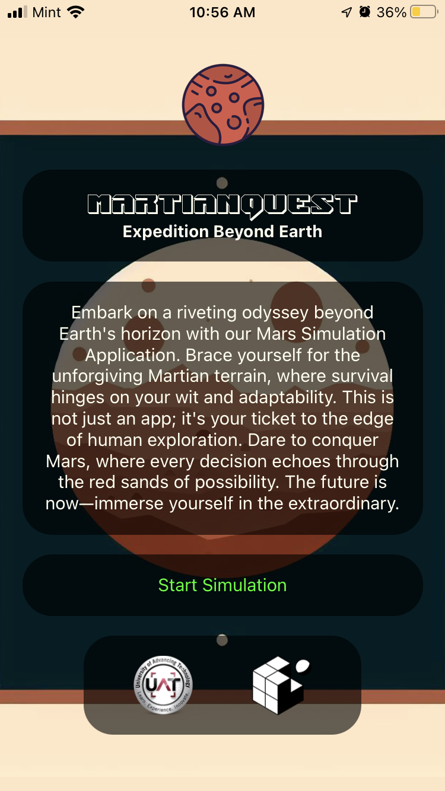
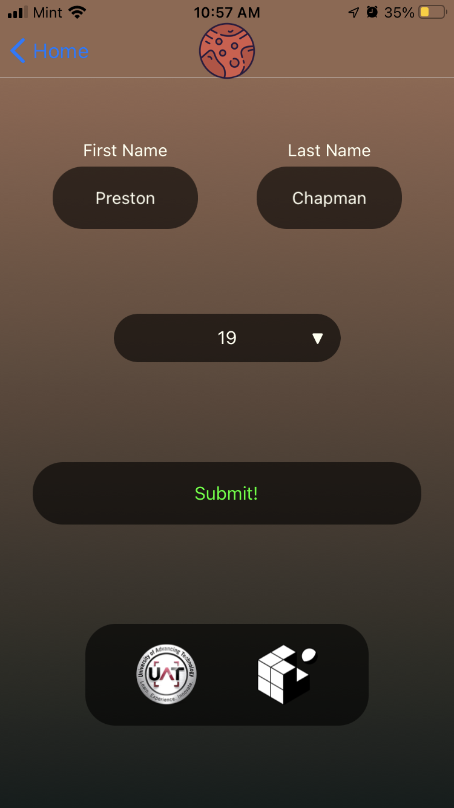
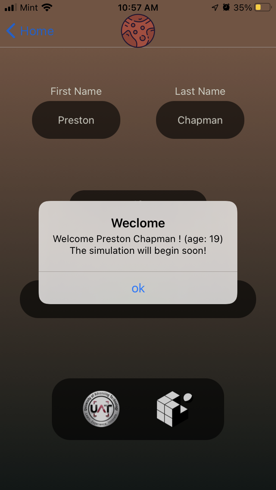
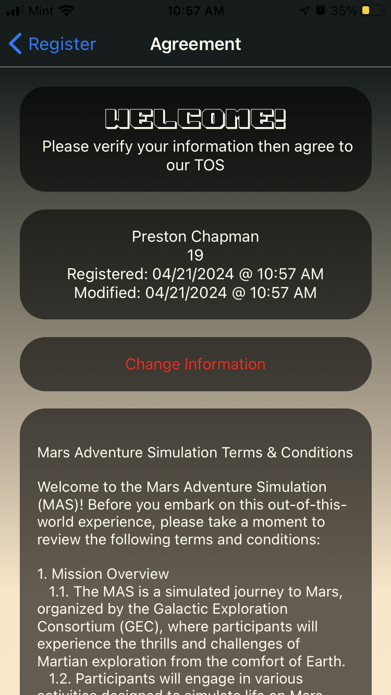
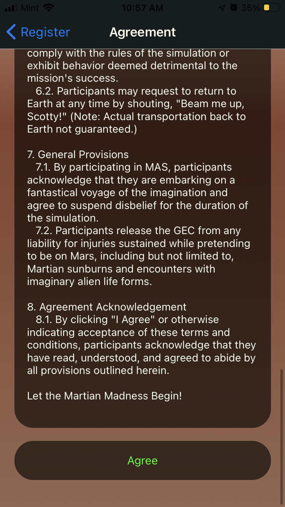
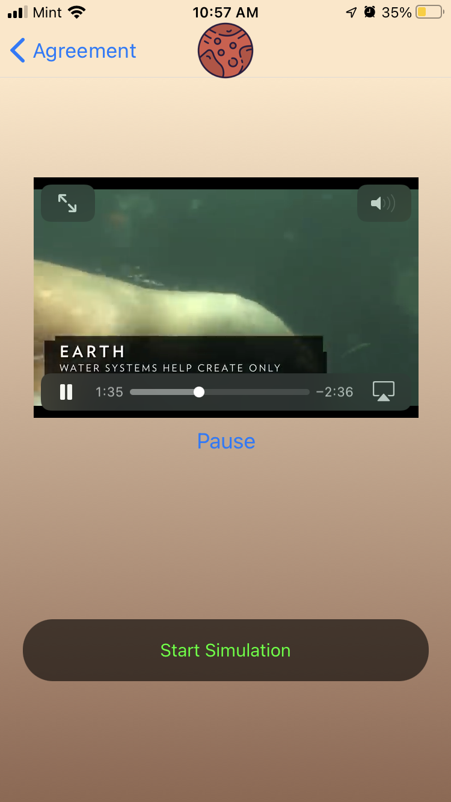
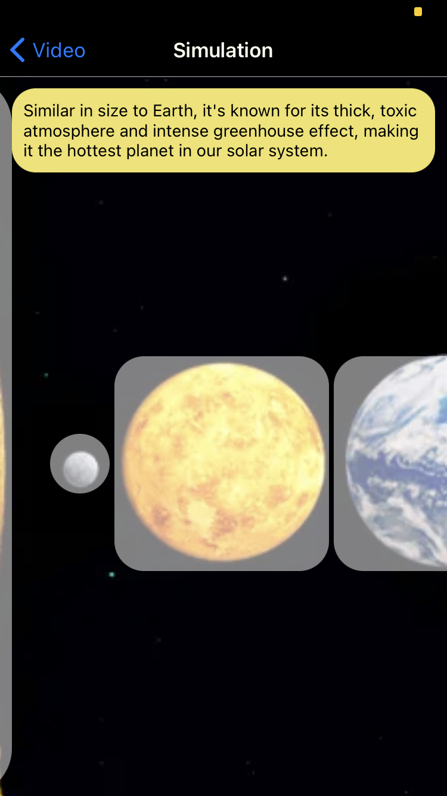
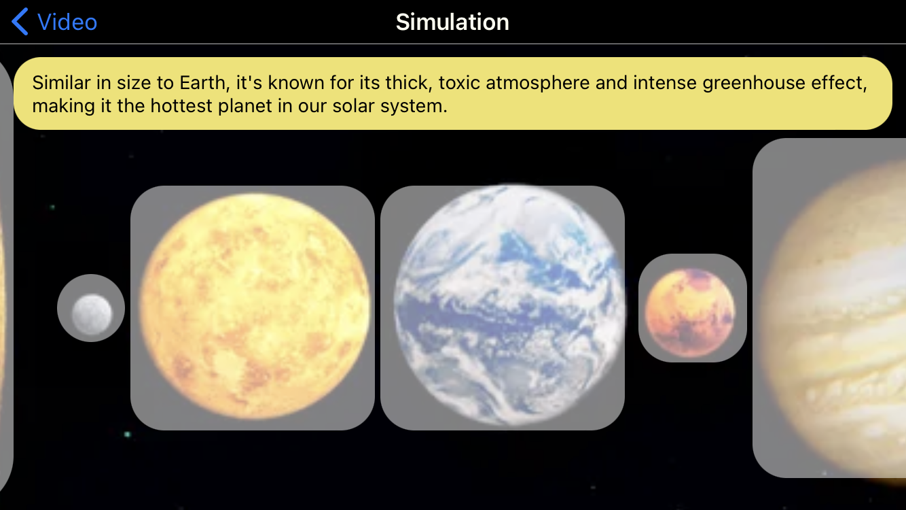

# Mars Simulation
This is the Mars Simulation project for CSC342, multiple assignments have been used with this project. This Github tracks assignments 8.1 and later

This project can be viewed at [Snack Expo Go](https://snack.expo.dev/@pchapman/mars-simulation)
## Pictures

  
14.1 Pictures

  
  
  
  
  
  
  
  

